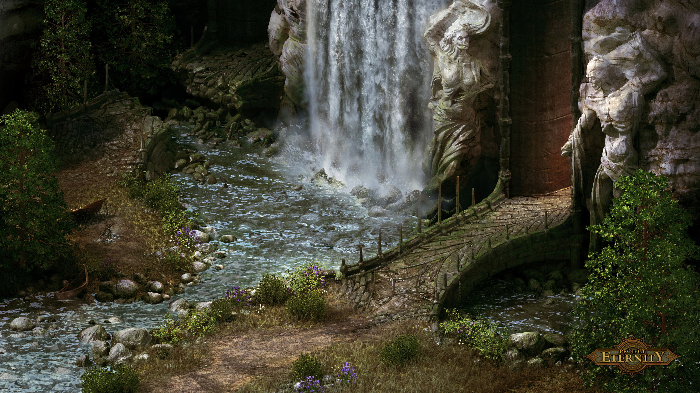
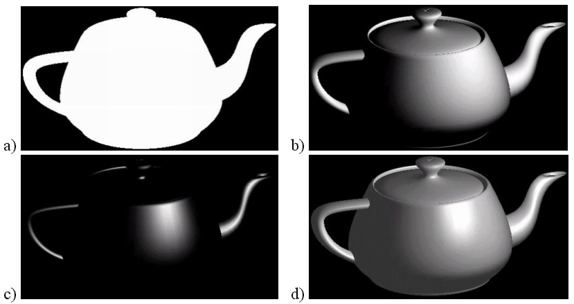
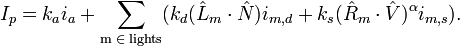
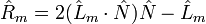

-----
Intro
-----

- Advanced lighting in 2D graphics aka **Awesome2D**

- Finding ways to do "3D" lighting in 2D for games

- Author: Ferdinand Majerech

- Supervisor: RNDr. Ladislav Mikeš

---------------------------
2D is not (completely) dead
---------------------------

- Integrated, mobile GPUs

- Easy programming

- Art not limited by tech

- Artists can "cheat"

- Don't always need 3D (RTS, Infinity-style RPG)

---------------------
Pre-rendered graphics
---------------------

- 3D -> tool -> 2D -> postprocessing -> game

- Can look photorealistic

- Low HW requirements 

- Lighting usually pre-rendered, static

----------------------------
2D dynamic lighting in games
----------------------------

- Homogenous lighting in a circle around the source

- Shadowing in special cases (e.g. interior with vertical walls)

- Can't light a complex object (no idea where "front" is)

----------------
We can do better
----------------

- Not much progress since 2000

- Generic Android phone has a better GPU than a GeForce 2

- Fixed function GPUs are dead

- We can build our software renderer in shaders

-----
Goals
-----

- Move forward from 2000

- Achieve "real" dynamic lighting in 2D

- Make it easy to implement in any engine

  * Tools

  * Documentation

-------
Sources
-------

- Inspiration: Normal/Parallax/Relief mapping in 3D

- Literature:

  * B. T. Phong, Illumination for computer generated pictures, Communications of ACM 18 (1975), no. 6, 311–317.
  * Blinn, J. F. 1978. Simulation of wrinkled surfaces. SIGGRAPH 1978.

- Cool stuff I want to use (time):

  * Mitchell, J., McTaggart, G., and Green, C. 2006. Shading in Valve's source engine. SIGGRAPH 2006.
  * Green, C. 2007. Efficient Self-Shadowed Radiosity Normal Mapping. SIGGRAPH 2007.

----------------------
Phong reflection model
----------------------

- Not Phong *shading* model

- Common in real-time 3D (fast & good image)

- Ambient, diffuse, specular

-----------------
Graphics pipeline
-----------------

- Vertex shader (3D primitives)

  * Vertex positions, colors, etc.

  * Not important here

- Fragment shader (pixels or subpixels)

  * Textures

  * Data calculated by vertex shader

----------------
Current approach
----------------

- Phong reflection model "in 2D"

- Can be built upon later

  * Self-shadowed radiosity normal mapping... in 2D

  * Environment mapping (sky reflection on shiny surfaces)

  * ...

- Game simulation still needs to be 3D, but not graphics

--------
Phong 2D
--------

- We only have 2D data (textures)

- Need all data for Phong model

  * From 3D simulation: Light/s, viewer positions
  * From textures (per pixel):

    - Relative position
    - Normal
    - Color (diffuse, specular)

------------
Texture data
------------

- Normals   (RGB8, RG8, palette)

- Specular? (RGB8, G8)

- Diffuse   (RGBA8)

- Position  (RGB8, heightmap)

- Memory/compute tradeoff

- Anywhere between 40bpp and 104bpp is possible

  * 2000: 8bpp or 32bpp
  * We have more VRAM now (but mobile...)

--------------------------
Texture (sprite) authoring
--------------------------

- Manual

  * Hard
  * Seriously? Paint positions in Photoshop?

- Pre-rendered 

  * No need to optimize models for a game
  * Million triangles is not a problem
  * Procedural textures

-------------
Pre-rendering
-------------

- Render-to-texture 

- Performance doesn't matter

- Phong model (without the "Phong" part)

- Render per-pixel data Phong model would use

- For diffuse, a raytracer with AA is better

- AA and vectors don't mix (2x resolution?)

--------------
Current status
--------------

- Demo app not yet started

- Working on pre-rendering

  * Only loading models works (DerelictAssimp)

- Portable "graphics engine" complete

  - VBuffers
  - IBuffers
  - Textures
  - **Modular shaders**
  - VFS, YAML, etc. (reused)

---------------
Modular shaders
---------------

- Can exchange shader program modules at run-time

- Primitive polymorphism

- Completely irrelevant to the work 

- Makes implementation much easier

-------
Roadmap
-------

- Finish pre-rendering tool 

- Implement demo & start working on the thesis

- Time-based:

  - GUI for the pre-rendering tool

  - Improve the lighting model (esp. self-shadowing)

- Integrate into engine

---------
More info
---------
 
- http://kiithcoding.nfshost.com
- https://github.com/kiith-sa/awesome2D
- D
- OpenGL2/GLSL 
- Assimp
- SDL2

-----------------------------
Thank you for your attention!
-----------------------------

.. header::

        Advanced lighting in 2D graphics

.. footer::

        © Ferdinand Majerech, 2012
